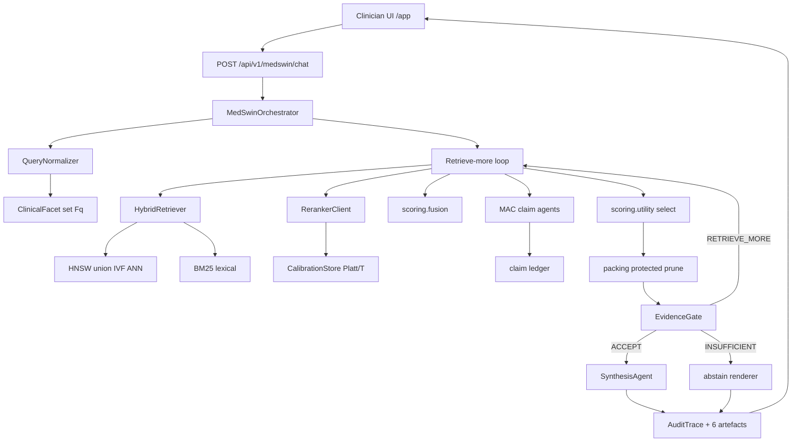
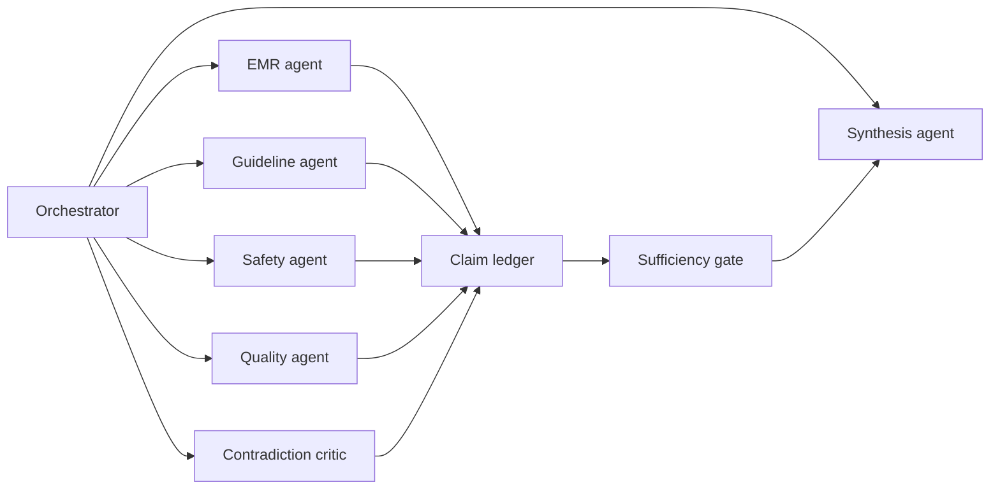
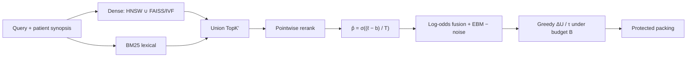
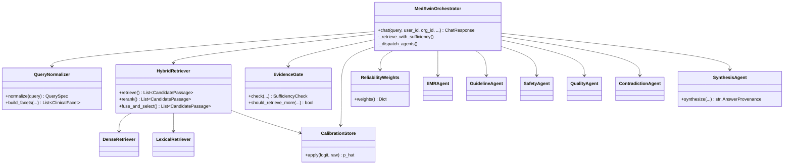

# MedSwin

Evidence-gated multi-agent clinical decision support (CDSS) runtime.

MedSwin does not treat top-K retrieval as automatically usable. For every clinician query it: decomposes clinical evidence facets, hybrid-retrieves EMR / CPG / literature / drug-safety passages, calibrates reranker scores, runs specialist agents that emit structured claims, applies an evidence-sufficiency gate, and only then synthesizes a grounded answer — or returns a bounded insufficient-evidence response with a full audit trail.

Paper source of truth: [`docs/MedSwin.tex`](docs/MedSwin.tex)  
API contract: [`docs/ENDPOINTS.md`](docs/ENDPOINTS.md)

---

## 1. What this repository implements

| Paper / plan contract | Runtime status | Primary modules |
| --- | --- | --- |
| Evidence-sufficiency gate before generation | Implemented | [`app/medswin/gate.py`](app/medswin/gate.py), [`app/medswin/abstain.py`](app/medswin/abstain.py) |
| Facet decomposition + critical-facet coverage | Implemented | [`app/medswin/normalize.py`](app/medswin/normalize.py), [`app/scoring/coverage.py`](app/scoring/coverage.py) |
| Stage-1 hybrid dense (HNSW ∪ IVF) + BM25 | Implemented | [`app/retrieval/`](app/retrieval/), [`app/indexes/hybrid.py`](app/indexes/hybrid.py) |
| Stage-2 pointwise rerank + Platt/temp calibration hooks | Implemented | [`app/scoring/calibrate.py`](app/scoring/calibrate.py), `data/calibration/rerank.json` |
| Fusion (log-odds) + budgeted utility selection | Implemented | [`app/scoring/fusion.py`](app/scoring/fusion.py), [`app/scoring/utility.py`](app/scoring/utility.py) |
| MAC: EMR / Guideline / Safety / Quality / Critic / Synthesis | Implemented | [`app/agents/`](app/agents/) |
| Agents inside retrieve-more (not only after gate) | Implemented | [`app/medswin/orchestrator.py`](app/medswin/orchestrator.py) |
| Hint-aware retrieve-more (`focus_source`, synonyms, safety, K′) | Implemented | [`app/retrieval/hints.py`](app/retrieval/hints.py) |
| Reliability-weighted agent influence (Beta LCB) | Implemented | [`app/agents/weights.py`](app/agents/weights.py), `data/calibration/agents.json` |
| Six audit artefacts | Implemented | [`app/schemas/traces.py`](app/schemas/traces.py), chat/trace APIs |
| Source types CPG / EMR / LIT / SAFETY | Implemented | [`app/schemas/enums.py`](app/schemas/enums.py) |
| Clinician CDSS UI | Implemented | [`web/`](web/) → served at `/app/` |
| Optional auth scaffold | Implemented | [`app/api/auth.py`](app/api/auth.py) (`ENABLE_AUTH`) |
| Offline SFT / KD / merge / reranker LoRA training | Out of scope (runtime-only) | — |
| Full IdP JWT verification / RBAC / OTEL | Scaffold / flags only | config + middleware |

**Residual (intentional / enterprise fill-in):** calibration file ships as identity `{b:0,T:1}` until you drop fitted Platt params; auth accepts Bearer structure when enabled but does not run a full JWT library stack; Mongo request path is Motor async while offline index builders may still use sync PyMongo.

---

## 2. End-to-end runtime pipeline



### Gate outcomes

| Action | Meaning |
| --- | --- |
| `accept` | Critical facets pass LCB, entropy, and contradiction constraints → synthesis allowed |
| `retrieve_more` | Gate fails; loop budget remains; hints route specialist + widen/focus retrieval |
| `insufficient_evidence` | Gate fails and further retrieval is exhausted or low utility → bounded CDS abstention |

---

## 3. Multi-agent coordination (MAC)

Orchestration is **centralized**. Agents do **not** peer-negotiate. They emit structured claims:

`(facet, claim, polarity, chunk_id, g_EBM, p̂_θ, provenance)`



| Agent | Role | Missing-facet route |
| --- | --- | --- |
| Normalize (supervisor) | Query → `QuerySpec` + facets | always first |
| EMR | Meds, labs, comorbidities, allergies | `patient_applicability` |
| Guideline | CPG recs, eligibility, strength/version | `guideline_concordance` |
| Safety | Contraindications, AEs, DDI, dose limits | `safety_contraindications` |
| Quality | Grade, recency, population fit, provenance | `evidence_quality` |
| Critic | High-severity conflicts vs outdated/mismatch | contradiction review |
| Synthesis | Final CDS answer **only** from accepted bundle | after `accept` |

Agent reliability priors \(r_i \sim \mathrm{Beta}(a_i,b_i)\) → LCB weights \(\omega_i\) from [`data/calibration/agents.json`](data/calibration/agents.json).

---

## 4. Two-stage retrieval and scoring



**Fusion (paper Eq. fusion):** calibrated reranker log-odds + dense/lex + recency/section/source + EBM − noise → logistic score.

**Coverage (noisy-OR):**  
\(\pi_j(\mathcal{M}) = 1 - \prod_d (1 - a_{dj}\,\widehat{p}_\theta\,g_{\mathrm{EBM}})\)  
with bootstrap LCB (\(N=64\)) and entropy gate.

**Selection:** maximize clinical utility under token budget \(B\) and \(K_{\max}\); protect safety / contradiction / required-source passages.

---

## 5. Package layout (one-word Python modules)

```text
app/
  schemas/          # enums, facets, evidence, agents, traces, sessions, documents
  medswin/          # orchestrator, normalize, gate, abstain, ledger, packing
  retrieval/        # hybrid, dense, lexical, filters, hints
  scoring/          # fusion, utility, coverage, calibrate, hierarchy
  agents/           # base, emr, guideline, safety, quality, critic, synthesis, weights
  indexes/          # hybrid ANN query (HNSW ∪ IVF)
  prompts/          # role claim prompts
  api/              # auth scaffold + v1 endpoints
  services/         # adapters (llm, embedding, reranker, limiter), governance shims
  core/             # config, database, indexing builders
web/                # clinician SPA (Vite/React + static public fallback)
data/calibration/   # rerank.json, agents.json
eval/               # TREC system audit harness (consumer of /medswin/chat)
docs/               # MedSwin.tex, ENDPOINTS.md
```

Legacy imports under `app/services/medswin/*` and `app/models/medswin.py` re-export the new packages so `eval/` and tests keep working.

---

## 6. Data model (UML-style entity diagram)

```mermaid
erDiagram
  ORGANIZATION ||--o{ SESSION : scopes
  ORGANIZATION ||--o{ DOCUMENT : scopes
  ORGANIZATION ||--o{ CHUNK : scopes
  ORGANIZATION ||--o{ AUDIT_TRACE : scopes
  SESSION ||--o{ AUDIT_TRACE : has
  DOCUMENT ||--o{ CHUNK : contains
  PATIENT ||--o{ CHUNK : "EMR scoped"
  PATIENT ||--o{ AUDIT_TRACE : optional

  AUDIT_TRACE ||--o| EVIDENCE_BUNDLE : selects
  AUDIT_TRACE ||--o{ SUFFICIENCY_CHECK : records
  AUDIT_TRACE ||--o{ POLICY_DECISION : records
  AUDIT_TRACE ||--o{ TOOL_CALL : records
  AUDIT_TRACE ||--o| FACET_MATRIX : exports
  AUDIT_TRACE ||--o| CONTRADICTION_LEDGER : exports
  AUDIT_TRACE ||--o| SUFFICIENCY_DECISION : exports
  AUDIT_TRACE ||--o| ANSWER_PROVENANCE : exports
  AUDIT_TRACE ||--o{ RETRIEVAL_TRACE : exports
  AUDIT_TRACE ||--o{ RERANK_TRACE : exports

  EVIDENCE_BUNDLE ||--o{ CANDIDATE_PASSAGE : includes
  EVIDENCE_BUNDLE ||--o{ EVIDENCE_LEDGER_ENTRY : ledgers
  EVIDENCE_BUNDLE ||--o{ FACET_COVERAGE : covers
  EVIDENCE_BUNDLE ||--o{ CONTRADICTION_PAIR : flags
  EVIDENCE_BUNDLE ||--o| POLICY_DECISION : gated_by

  EVIDENCE_LEDGER_ENTRY ||--o{ EVIDENCE_CLAIM : claims
  QUERY_SPEC ||--o{ CLINICAL_FACET : requires
  CANDIDATE_PASSAGE }o--|| CHUNK : references

  ORGANIZATION {
    string org_id
  }
  PATIENT {
    string patient_id
  }
  SESSION {
    string session_id
    string user_id
    string org_id
    datetime created_at
    datetime last_active
  }
  DOCUMENT {
    string doc_id
    enum source_type
    string title
    string version
    string patient_id
    string org_id
    float source_reliability
  }
  CHUNK {
    string chunk_id
    string doc_id
    enum source_type
    string text
    string section
    string patient_id
    string org_id
    float[] embedding
    string embedding_space
  }
  CLINICAL_FACET {
    string name
    bool required
    float threshold
    float weight
    string source_policy
  }
  QUERY_SPEC {
    string[] canonical_terms
    enum clinical_scope
  }
  CANDIDATE_PASSAGE {
    string chunk_id
    float dense_score
    float lexical_score
    float calibrated_score
    float fusion_score
  }
  EVIDENCE_CLAIM {
    string facet
    string claim
    enum polarity
    string chunk_id
    float confidence
  }
  EVIDENCE_LEDGER_ENTRY {
    string chunk_id
    string agent_id
    float calibrated_relevance
  }
  FACET_COVERAGE {
    string facet
    float coverage_probability
    float lower_confidence_bound
    float entropy
    string status
  }
  CONTRADICTION_PAIR {
    string facet
    string chunk_id_a
    string chunk_id_b
    string severity
    bool resolved
  }
  POLICY_DECISION {
    bool passed
    enum action
    string reason
    string routed_agent
  }
  AUDIT_TRACE {
    string trace_id
    string session_id
    string query
    string final_answer
  }
```



### Source types

`CPG` · `EMR` · `LIT` · `SAFETY`

### Policy actions

`accept` · `retrieve_more` · `insufficient_evidence` · `require_clarification`

### Evidence polarity

`supports` · `contradicts` · `qualifies` · `safety` · `irrelevant`

---

## 7. Class / component view



---

## 8. Audit artefacts (per query)

| # | Artefact | Contents |
| --- | --- | --- |
| 1 | Retrieval trace | Agent/source/facet retrieval pool, dense/lex counts, hints |
| 2 | Rerank trace | Calibrated scores, selected/rejected chunk IDs, calibration version |
| 3 | Facet-coverage matrix | Per-facet status: satisfied / uncertain / missing / contradicted + LCB/entropy |
| 4 | Contradiction ledger | High-severity pairs, severity, resolution |
| 5 | Sufficiency decision | `accept` / `retrieve_more` / `insufficient_evidence` + routed agent |
| 6 | Answer provenance | Statement → accepted `chunk_id` links; rejected fabricated IDs |

Returned on `ChatResponse` and enriched via `GET /api/v1/medswin/traces/{trace_id}?include_details=true`.

---

## 9. Local setup

```bash
python3 -m venv .venv
source .venv/bin/activate
pip install -r requirements.txt
cp env.example .env

# MongoDB
docker run -d -p 27017:27017 --name mongodb mongo:6.0

# API
python3 -m uvicorn app.main:app --reload --port 8100
```

| Surface | URL |
| --- | --- |
| Clinician UI | [http://localhost:8100/app/](http://localhost:8100/app/) |
| OpenAPI | [http://localhost:8100/docs](http://localhost:8100/docs) |
| Health | `GET /health` |

### Clinician UI (optional Vite build)

A zero-build static UI is served from [`web/public/`](web/public/). For the React SPA:

```bash
cd web
npm install
npm run build    # writes web/dist → mounted at /app/
npm run dev      # Vite on :5173, proxies /api → :8100
```

---

## 10. Main API endpoints

| Method | Path | Purpose |
| --- | --- | --- |
| `POST` | `/api/v1/medswin/chat` | Full MAC + gate pipeline |
| `GET` | `/api/v1/medswin/sessions/{session_id}` | Session summary |
| `GET` | `/api/v1/medswin/traces/{trace_id}` | PHI-safe audit (optional details) |
| `POST` | `/api/v1/medswin/ingest` | Ingest CPG / EMR / LIT / SAFETY docs |
| Legacy | `/api/v1/{preprocessing,embedding,retrieval,storage,dashboard}` | Ops / legacy RAG |

All MedSwin routes require `org_id`. EMR hard-filter applies when EMR-only / patient-scope-only; mixed CDS keeps EMR patient-scoped while allowing CPG/LIT/SAFETY.

Example chat:

```bash
curl -s http://localhost:8100/api/v1/medswin/chat \
  -H 'Content-Type: application/json' \
  -d '{
    "query": "Can this patient continue metformin after the latest renal-function result?",
    "user_id": "clinician-1",
    "org_id": "demo-org",
    "patient_id": "patient-42"
  }'
```

---

## 11. Configuration

| Variable | Purpose | Default / note |
| --- | --- | --- |
| `APP_PORT` | FastAPI port | `8100` |
| `MONGODB_URL` / `MONGODB_DB` | Mongo | `mongodb://localhost:27017` / `medswin` |
| `SUPERVISOR_URL`, `AGENT1_URL`…`AGENT3_URL` | LLM endpoints | localhost OpenAI-compatible |
| `EMBEDDING_URL` / `RERANKER_URL` | Embedding & rerank | local or cloud |
| `CLOUD_MODE` | Azure AI Foundry path | `false` |
| `CANDIDATE_K` / `CANDIDATE_K_PRIME` | Candidate pools | `80` / `120` |
| `MAX_RETRIEVE_LOOPS` | Retrieve-more budget | `3` |
| `TOKEN_BUDGET_B` | Evidence token budget | `1800` |
| `SUFF_FACET_THRESHOLD` | Default facet θ | `0.70` |
| `SUFF_CRITICAL_FACET_THRESHOLD` | Critical facet θ | `0.78` |
| `SUFF_LCB_MARGIN` | LCB fallback margin | `0.08` |
| `SUFF_MAX_ENTROPY` | Max facet entropy | `0.88` |
| `SUFF_MAX_CONTRADICTIONS` | Max unresolved conflicts | `0` |
| `SUFF_MIN_MARGINAL_UTILITY` | ε_U for retrieve-more | `0.0002` |
| `RERANK_CALIBRATION_PATH` | Platt `{b,T,version}` | `./data/calibration/rerank.json` |
| `AGENT_RELIABILITY_PATH` | Beta priors | `./data/calibration/agents.json` |
| `ENABLE_AUTH` | Bearer gate | `false` |
| `TRACE_REDACT_BY_DEFAULT` | PHI-safe traces | `true` |
| `W_RERANK`, `W_DENSE`, `W_LEX`, `W_EBM`, `W_NOISE` | Fusion weights | see `app/core/config.py` |

Invalid enterprise policy thresholds fail startup.

### Calibration artefacts

```json
// data/calibration/rerank.json
{ "b": 0.0, "T": 1.0, "version": "platt:default-identity" }
```

If the file is missing or identity, chat sets `degraded_mode.calibration=true` and still runs (fail-open with explicit degradation).

---

## 12. Core guarantees

1. **Org isolation** — sessions, traces, chunks, documents, retrieval filters are `org_id`-scoped.
2. **Patient EMR scoping** — EMR chunks hard-filter on `patient_id` for EMR-only / patient-scope; mixed CDS cannot pull another patient’s EMR as “literature”.
3. **Facet gate** — generation requires critical-facet LCB ≥ θ, entropy ≤ \(H_{\max}\), no unresolved high-severity contradictions.
4. **No top-K authorization** — source counts are summaries only; they do not authorize answers.
5. **Citation hardening** — synthesis may only cite `chunk_id`s present in the accepted bundle.
6. **CDS boundary** — responses are clinician decision support, not autonomous diagnosis/orders.
7. **PHI-safe traces** — default redaction of emails, phones, MRNs, DOBs in trace summaries.
8. **Bounded abstention** — insufficient/conflicting evidence returns an explicit limited response, not a confident recommendation.

---

## 13. Testing and evaluation

```bash
python3 -m pytest
# focused
python3 -m pytest tests/test_medswin_policy.py tests/test_medswin_governance.py tests/test_medswin_retrieval.py -q
```

System-level TREC CDS audit lives under [`eval/`](eval/) and calls the production `/medswin/chat` + `/traces/{id}` contract (see `eval/README.md`).

---

## 14. Important files

| Path | Responsibility |
| --- | --- |
| [`app/medswin/orchestrator.py`](app/medswin/orchestrator.py) | MAC loop, gate, synthesis / abstain |
| [`app/medswin/gate.py`](app/medswin/gate.py) | Sufficiency decision |
| [`app/retrieval/hybrid.py`](app/retrieval/hybrid.py) | Two-stage retrieve + rerank glue |
| [`app/scoring/`](app/scoring/) | Fusion, utility, coverage, calibration, EBM |
| [`app/agents/`](app/agents/) | Structured claim specialists |
| [`app/schemas/`](app/schemas/) | Pydantic artefacts |
| [`app/api/v1/endpoints/medswin.py`](app/api/v1/endpoints/medswin.py) | Chat / session / trace / ingest |
| [`web/`](web/) | Clinician CDSS UI |
| [`data/calibration/`](data/calibration/) | Fitted score & agent reliability artefacts |
| [`docs/MedSwin.tex`](docs/MedSwin.tex) | Architecture paper |
| [`docs/ENDPOINTS.md`](docs/ENDPOINTS.md) | API contracts |

---

## 15. Design motto

> Generic RAG asks *What passages should be placed in the prompt?*  
> MedSwin asks *Is the available evidence enough to support this clinical answer?*
